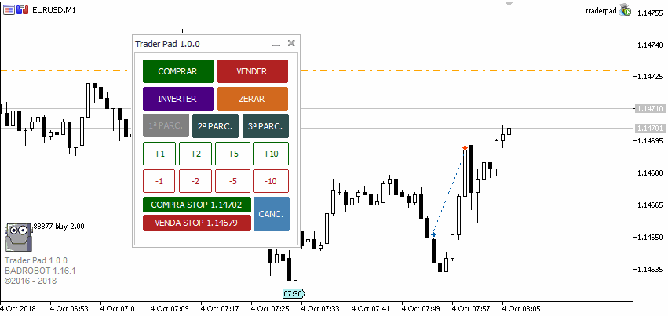

# traderpad.bad-robot

Trader Pad é uma ferramenta de extensão para potencializar a performance de um trader. Faz todo o controle do trade a partir do ponto de entrada, não sendo necessario a gestão manual da operação.

Quer utilizar o robô e não sabe como obter o executável apenas com o código-fonte? Entre em contato através do email erlon.efs@gmail.com para fornece-lo. E bons trades!

